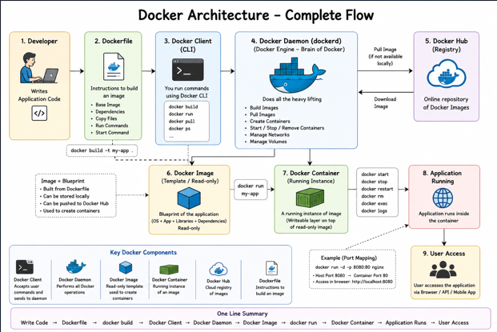

# Day 29 -- Docker Basics

---

# 1. Docker Theory

## What is Docker?

Docker is an open-source platform used to build, package, ship, and run
applications inside lightweight environments called **containers**.

It solves the famous problem:

> "It works on my machine."

---

## What is a Container?

A container is an isolated environment that contains:

- Application
- Runtime
- Libraries
- Dependencies
- Configuration

Containers share the host operating system kernel, making them
lightweight and fast.

### Why do we need containers?

- Same environment everywhere
- Faster deployment
- Lightweight
- Easy scaling
- Easy sharing
- Consistent development and production environments

---

## Containers vs Virtual Machines

Containers Virtual Machines

---

Share host OS kernel Have their own OS
Lightweight Heavy
Start in seconds Take minutes
Low resource usage High resource usage
High density Lower density

---

# Docker Architecture

Main Components

- Docker Client
- Docker Daemon
- Docker Images
- Docker Containers
- Docker Registry (Docker Hub)

## Workflow

Dockerfile → Image → Container

## Architecture Diagram



# 2. Verify Docker Installation

```bash
docker --version
docker version
docker info
```

Difference:

- `docker --version` → Docker CLI version
- `docker version` → Client + Server
- `docker info` → Complete Docker Engine information

---

# 3. First Container

Run:

```bash
docker run hello-world
```

Then:

```bash
docker ps
docker ps -a
```

Understand why `hello-world` exits immediately.

---

# 4. Run an Nginx Container

Without port mapping:

```bash
docker run nginx
```

Run with port mapping:

```bash
docker run -d -p 8080:80 nginx
```

Open:

    http://localhost:8080

Practice:

```bash
docker ps
docker logs <container-id>
docker stop <container-id>
docker rm <container-id>
```

---

# 5. Ubuntu Interactive Container

```bash
docker run -it ubuntu bash
```

Inside Ubuntu:

```bash
pwd
ls
cd /
mkdir test
touch hello.txt
cat /etc/os-release
uname -a
exit
```

---

# 6. Detached Mode

```bash
docker run -d nginx
docker ps
docker stop <container-id>
```

Detached mode (`-d`) runs the container in the background.

---

# 7. Custom Container Name

```bash
docker run -d --name my-nginx -p 8080:80 nginx
```

Practice:

```bash
docker ps
docker stop container_id
docker start container_id
docker restart container_id
docker rm container_id
```

---

# 8. Execute Commands Inside a Running Container

```bash
docker exec -it my-nginx bash
```

If `bash` is unavailable:

```bash
docker exec -it my-nginx sh
```

Practice:

```bash
ls
pwd
cd /usr/share/nginx/html
cat index.html
exit
```

---

# 9. View Logs

```bash
docker logs my-nginx
docker logs -f my-nginx
```

---

# 10. Images

List images:

```bash
docker images
```

Remove an image:

```bash
docker rmi hello-world
```

Docker will not remove an image if a container still depends on it.

---

# 11. Cleanup

Remove stopped containers:

```bash
docker container prune
```

Remove unused images:

```bash
docker image prune
```

---