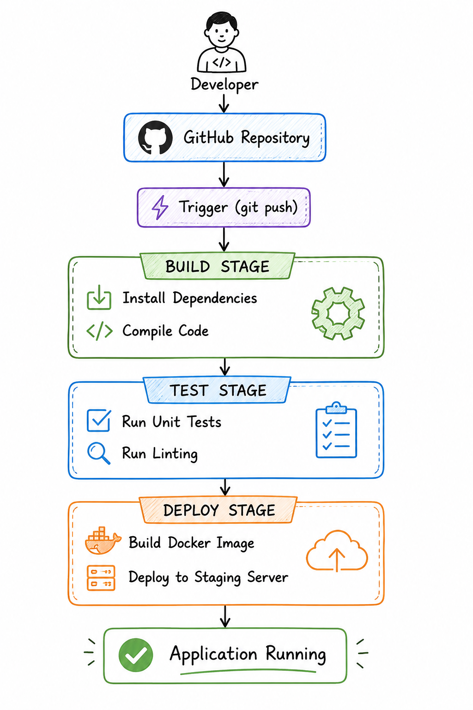
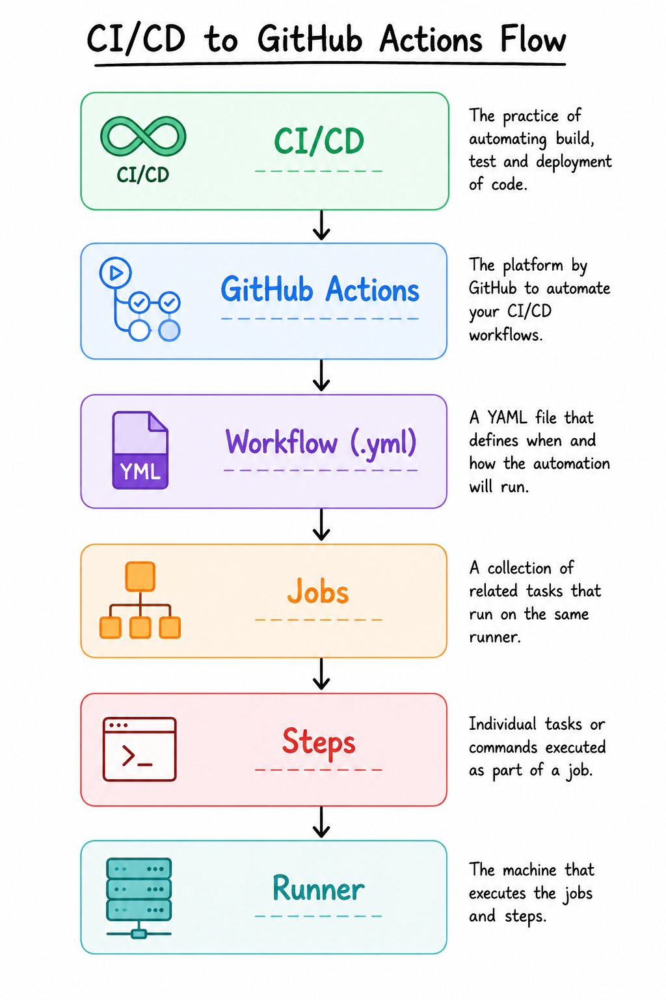

# Day 39 – CI/CD Concepts

## Objective

Today I learned the fundamentals of **Continuous Integration (CI)** and **Continuous Delivery/Deployment (CD)**. I also explored how a CI/CD pipeline works, understood its components, and examined a real GitHub Actions workflow from the React repository.

---

# Task 1: The Problem

## Scenario

Imagine a team of five developers working on the same application and manually deploying code to production.

### What can go wrong?

- Code conflicts between developers.
- Manual deployment mistakes.
- Wrong version deployed to production.
- Tests may be skipped accidentally.
- Human errors during deployment.
- Production downtime.
- Difficult to track deployment history.

### What does "It works on my machine" mean?

"It works on my machine" means the application works correctly on a developer's computer but fails on another developer's machine or in production because of differences in the operating system, dependencies, configuration, or environment variables.

### How many times a day can a team safely deploy manually?

Generally, only **1–2 deployments per day** because manual deployments are slow, error-prone, and require careful coordination.

---

# Task 2: CI vs CD

## Continuous Integration (CI)

Continuous Integration is the practice of frequently merging code into a shared repository. Every code change automatically triggers a build and test process to detect issues early.

**Real-world Example**

A developer pushes code to GitHub, and GitHub Actions automatically builds the project and runs unit tests.

---

## Continuous Delivery

Continuous Delivery extends CI by ensuring the application is always ready for deployment. After all tests pass, deployment to production requires **manual approval**.

**Real-world Example**

An application successfully completes all CI checks, and a release engineer manually clicks **Deploy** to release it.

---

## Continuous Deployment

Continuous Deployment automatically deploys every successful build to production without requiring manual approval.

**Real-world Example**

Netflix automatically deploys every successful build to production after all automated tests pass.

---

## CI vs Delivery vs Deployment

| Feature | Continuous Integration | Continuous Delivery | Continuous Deployment |
|----------|-----------------------|---------------------|----------------------|
| Build | ✅ | ✅ | ✅ |
| Test | ✅ | ✅ | ✅ |
| Ready for Deployment | ❌ | ✅ | ✅ |
| Manual Approval | ❌ | ✅ | ❌ |
| Automatic Production Deployment | ❌ | ❌ | ✅ |

---

# Task 3: Pipeline Anatomy

## Trigger

A trigger is the event that starts a CI/CD pipeline.

Examples:

- Push
- Pull Request
- Schedule
- Manual Trigger

---

## Stage

A stage is a logical phase of the pipeline.

Examples:

- Build
- Test
- Deploy

---

## Job

A job is a collection of related tasks executed on the same runner.

Example:

Build Job

- Install Dependencies
- Compile Application

---

## Step

A step is a single command or action executed inside a job.

Example:

```bash
npm install
```

```bash
npm test
```

---

## Runner

A runner is the machine that executes the workflow.

Examples:

- GitHub-hosted Runner
- Self-hosted Runner

---

## Artifact

An artifact is the output generated by a job.

Examples:

- Docker Image
- JAR File
- ZIP Package
- Test Reports

---

# Task 4: CI/CD Pipeline Diagram

The following diagram illustrates a simple CI/CD pipeline where a developer pushes code to GitHub. The application is automatically built, tested, containerized, and deployed to a staging server.

<p align="center">
  
</p>

## Pipeline Flow

1. Developer pushes code to GitHub.
2. GitHub receives the code and triggers the CI/CD pipeline.
3. Build Stage installs dependencies and compiles the application.
4. Test Stage runs unit tests and linting.
5. Deploy Stage builds a Docker image and deploys it to the staging server.
6. The application is successfully running on the staging environment.

---

# Task 5: Explore a Real GitHub Actions Workflow

## Repository

**Repository:** React

**Workflow File:** `runtime_build_and_test.yml`

### Trigger

The workflow starts when:

- Code is pushed to the **main** branch.
- Code is pushed to **release** branches.
- A Pull Request is created or updated.
- The workflow is manually triggered using **workflow_dispatch**.

### Number of Jobs

This workflow contains **multiple jobs (20+ jobs)** including:

- Cache Dependencies
- Flow Check
- Test
- Build and Lint
- Test Build
- DevTools Tests
- Flight Tests
- Process Artifacts
- Sizebot

### What Does This Workflow Do?

The workflow performs the following tasks:

- Checks out the source code.
- Sets up the Node.js environment.
- Restores dependency caches.
- Installs project dependencies.
- Runs Flow type checking.
- Executes unit tests.
- Builds the React project.
- Runs linting.
- Uploads build artifacts.
- Executes browser and end-to-end tests.


### Observation

This workflow is an example of **Continuous Integration (CI)** because it automatically validates every code change before it is merged. It focuses on building, testing, linting, and generating artifacts rather than deploying the application to production.

---

# Task 6: Connecting CI/CD to GitHub Actions

The following diagram shows how CI/CD concepts map to GitHub Actions.

<p align="center">
  
</p>

## Workflow Hierarchy

- **CI/CD** is the software development practice.
- **GitHub Actions** is GitHub's automation platform.
- A **Workflow** is written in a YAML (`.yml`) file.
- A workflow consists of one or more **Jobs**.
- Every job contains multiple **Steps**.
- A **Runner** executes the workflow.

---

# What I Learned

1. CI automatically builds and tests every code change.
2. Continuous Delivery requires manual approval before production deployment.
3. Continuous Deployment automatically deploys every successful build.
4. GitHub Actions uses workflows, jobs, steps, and runners to automate software delivery.
5. Large projects divide work into multiple parallel jobs to reduce execution time.
6. Caching dependencies significantly speeds up workflow execution.
7. A failed pipeline is beneficial because it prevents broken code from reaching production.

---

# Repository Structure

```text
2026/
└── day-39/
    ├── day-39-cicd-concepts.md
    ├── pipeline-diagram.png
    ├── github-actions-flow.png
    └── react-workflow.png
```

---

# Git Commands

```bash
git add .
git commit -m "Day 39: Learned CI/CD Concepts"
git push origin main
```

---

# Conclusion

Today I learned the importance of CI/CD in modern software development. I understood the differences between Continuous Integration, Continuous Delivery, and Continuous Deployment, explored the anatomy of a CI/CD pipeline, and analyzed a real GitHub Actions workflow from the React repository. I also learned how GitHub Actions workflows are organized into workflows, jobs, steps, and runners, which forms the foundation for building automated CI/CD pipelines.